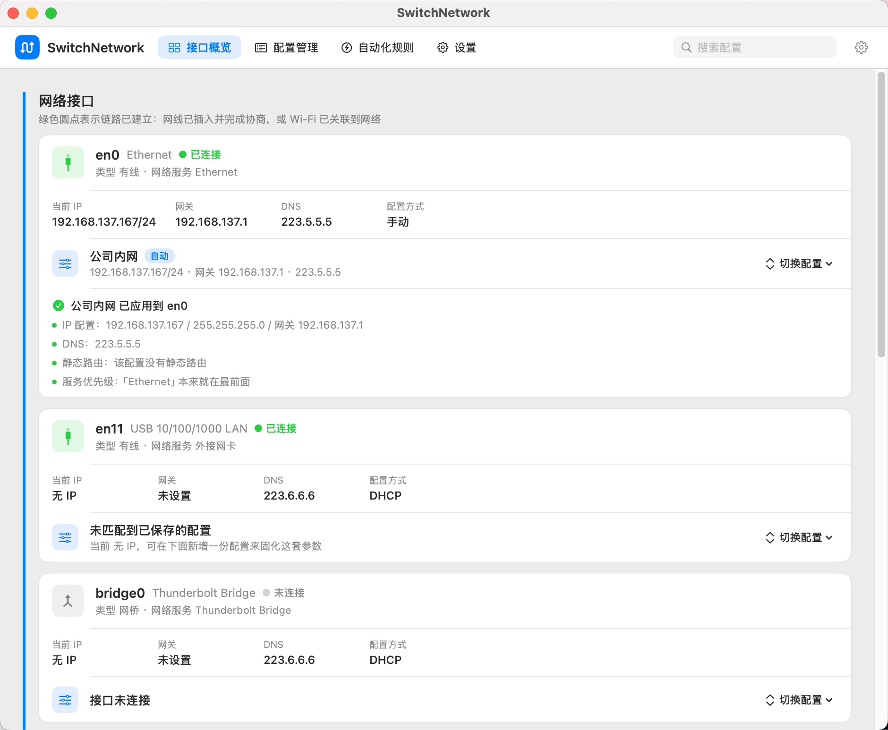
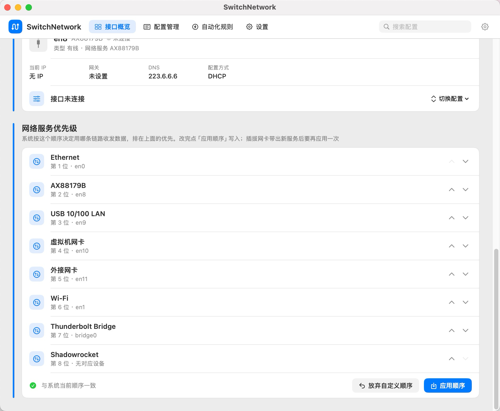
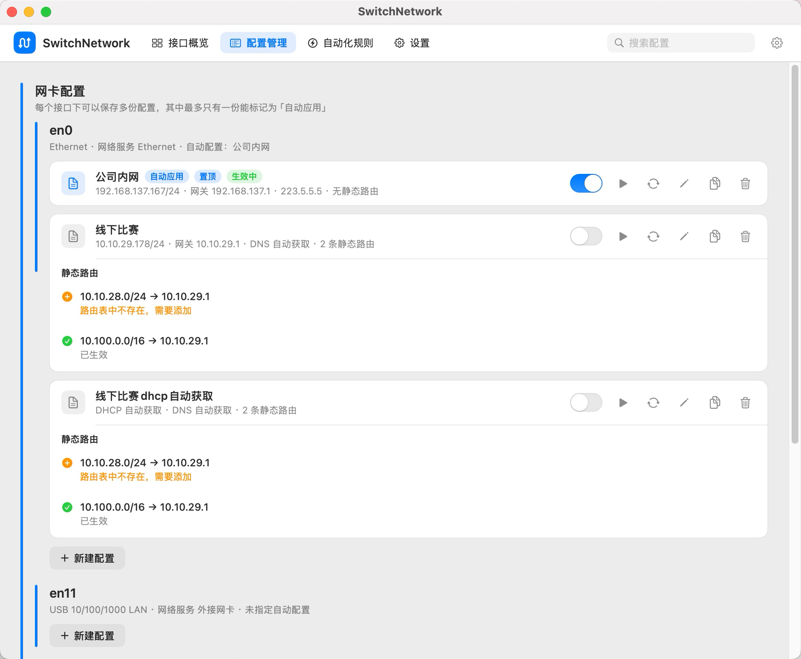
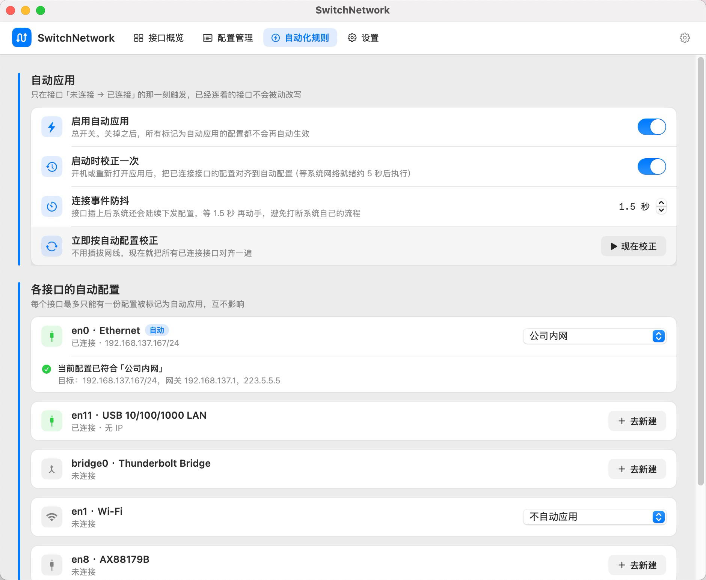
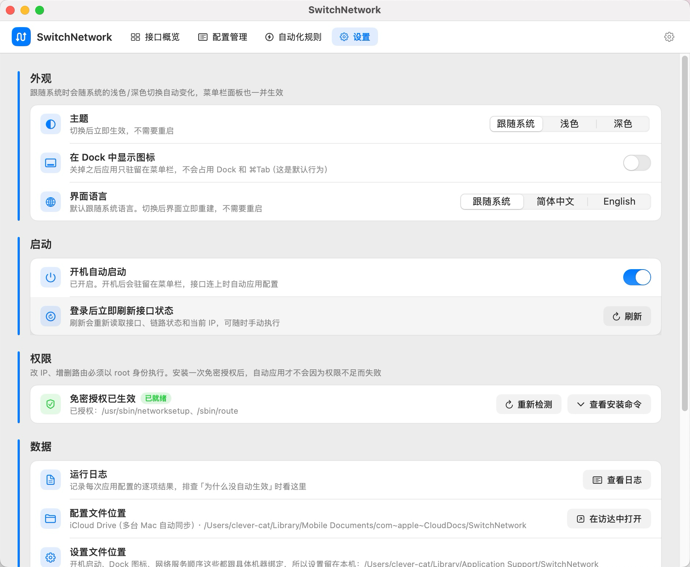

# SwitchNetwork

**简体中文** | [English](README.en.md)

macOS 上按场景切换网络配置的小工具。

把一套「IP / 掩码 / 网关 / DNS / 静态路由」存成一份**配置**，插上网线自动套用，或者点一下切换；不需要的时候一键把接口**交还系统**（切回 DHCP、DNS 自动获取、撤掉本应用写进去的静态路由）。

## 界面预览

**接口概览** —— 每个接口当前的 IP、网关、DNS、配置方式，链路通没通、这份配置是不是自动应用的，都在这一页。



| **网络服务优先级** | **配置管理** |
|---|---|
|  |  |
| **自动化规则** | **设置** |
|  |  |

## 功能

- **接口概览** —— 列出所有网络接口的当前 IP、网关、DNS、配置方式，一眼看出哪条链路是通的，并显示这份配置是不是自动应用的。
- **配置管理** —— 一份配置包含：手动 IP/DHCP、DNS、若干条静态路由（目标网段 + 下一跳）、是否在应用时把该网络服务的优先级提到最前。
- **自动化规则** —— 插拔网卡、Wi-Fi 关联到网络时自动套用对应配置（有防抖，不会在链路抖动时反复写入）。自动应用只会在接口已连接时触发。
- **交还系统** —— 不套用任何配置，把接口还给 macOS：先撤静态路由再切回 DHCP（路由的下一跳还在旧网段里，顺序反了会有一段流量被丢进黑洞），DNS 也一并交回自动获取。
- **网络服务优先级** —— 直接管理 macOS 的「服务顺序」，系统据此决定用哪条链路收发数据。
- **回收站** —— 删除配置先进回收站，默认保留 30 天，期间可以还原；超期或不想要的可以立刻彻底删除。
- **iCloud 同步** —— 配置和回收站放在 iCloud Drive 里，多台 Mac 之间自动同步；机器上没开 iCloud 就自动退回本机目录。
- **应用内检查更新** —— 启动后自动查一次，也可以手动查；发现新版本能直接下载并替换，旧版本留一份备份，可以一键回退。
- **中英文界面** —— 跟随系统，也可以在设置里固定。深色/浅色/跟随系统。

## 系统要求

- macOS 11 Big Sur 或更新（通用二进制，Intel 和 Apple 芯片都能跑）
- 修改 IP 和路由需要管理员权限。首次使用到「设置 → 权限」点一次**一键安装授权**，它会在 `/etc/sudoers.d/` 里写一条**只放行 `networksetup` 和 `route` 这两个命令**的免密规则，之后开关机、插拔网卡都不再弹密码。

## 安装

1. 从 [Releases](https://github.com/cat-clever/SwitchNetwork/releases) 下载最新的 `SwitchNetwork-<版本>.dmg`
2. 打开 dmg：
   - 把 `SwitchNetwork.app` 拖进「应用程序」，**或者**
   - 双击镜像里的 `安装 SwitchNetwork（双击运行）.command`，它会问一句就把 app 装好，并顺手清掉隔离属性（需要输入开机密码，用的是系统 `xattr` 命令）
3. 首次打开如果提示「无法验证开发者」：右键（或按住 Control 点击）app → 打开 → 在弹窗里再点一次「打开」。只需一次。

> 这个 app 没有 Apple 开发者签名（个人工具，不打算买证书），所以才有上面这一步。或者你也可以直接自己编译，见下文。

## 使用

主窗口分四个分区：**接口概览 / 配置管理 / 自动化规则 / 设置**。

配置里的几个字段：

| 字段 | 说明 |
|---|---|
| 接口 | 绑到哪个网络接口（`en0`、`en1`…） |
| IP 方式 | 手动填 IP/掩码/网关，或者走 DHCP |
| DNS | 手动填服务器列表，或者交给系统自动获取 |
| 静态路由 | 目标网段 + 下一跳，应用配置时逐条写入 |
| 提到最前 | 应用时把这个网络服务调到服务顺序的第一位 |

有些操作需要管理员权限，失败时会在概览页显示每一步的结果（成功/提示/失败），日志里也有完整记录。

## 数据存在哪

| 内容 | 位置 |
|---|---|
| 配置、回收站 | 有 iCloud：`~/Library/Mobile Documents/com~apple~CloudDocs/SwitchNetwork/`<br>没有 iCloud：`~/Library/Application Support/SwitchNetwork/` |
| 设置 | `~/Library/Application Support/SwitchNetwork/settings.json`（始终在本机） |
| 日志 | `~/Library/Logs/SwitchNetwork.log` |

设置**不跟着 iCloud 走**是有意的：里面有「开机启动」「显示在 Dock」「网络服务顺序」这类跟具体机器绑定的东西，同步到另一台 Mac 上只会带来困惑。

配置文件都是可读写的 JSON，想手工改或者备份直接拷走也行。放 iCloud 有个前提：另一台机器上如果还没把文件下载下来（macOS 会为了省空间把文件驱逐成占位符），本应用会**暂停写入**并提示，避免把云端的真配置覆盖成空——看到那个提示时联网等一会儿再重开即可。

## 更新

启动后会自动查一次有没有新版本（只是对 GitHub 的 releases 接口发一次 GET），也可以在「设置」里手动查。

有新版本时可以点「下载并安装」：下载 dmg → 校验 SHA256 → 校验镜像里 app 的版本和签名 → 装进「应用程序」→ 重启。替换前旧版本会留一份备份，出问题可以在设置里**一键回退**。

几点说明：

- 只有 app 本身跑在 `/Applications` 里才会自我替换。从 Xcode 直接运行时（产物在 DerivedData 里）只会提示你打开发布页。
- macOS 13 及以上第一次替换时，系统可能弹出「SwitchNetwork 想修改其他应用」的授权请求，允许一次即可；拒绝了就会退化成提示你手动安装 dmg。
- 手动装也随时可以：下载新 dmg 覆盖安装，配置不会丢。

## 从源码构建

需要 Xcode（命令行工具不够，要完整的 Xcode.app）。

```bash
git clone https://github.com/cat-clever/SwitchNetwork.git
cd SwitchNetwork
open SwitchNetwork.xcodeproj      # 或直接命令行编译：
xcodebuild -project SwitchNetwork.xcodeproj -scheme SwitchNetwork \
    -configuration Debug -destination 'platform=macOS' build
```

打包成 dmg：

```bash
./make_dmg.sh                     # 默认 Release，产物 SwitchNetwork-<版本>.dmg
./make_dmg.sh Debug               # 打 Debug 版
```

`make_dmg.sh` 会把编译、拿版本号、组装镜像一次做完，dmg 里放 app、安装脚本和指向「应用程序」的替身。脚本自己找 `xcodebuild`；如果系统当前选中的开发者目录不是 Xcode，它会自动改用 `/Applications/Xcode.app`，不用先跑 `sudo xcode-select`。

## 发版

版本号只在**一个文件**里改：`Config/SwitchNetwork.xcconfig`。

```
MARKETING_VERSION = 0.0.1
CURRENT_PROJECT_VERSION = 1
SWITCHNETWORK_GITHUB_REPO = cat-clever/SwitchNetwork
```

改完 `MARKETING_VERSION` 推到 `main`，GitHub Action 会自动：编译 → 校验产物里的版本号和配置一致 → 打包 dmg → 算 SHA256 → 打 `v<版本>` 标签并发 Release（附件是 dmg 和 dmg 的 `.sha256`）。

- 同一个版本只会发一次。标签已存在时工作流直接跳过，所以重复 push 不会报错；要重发就把 GitHub 上的 Release 和标签删掉，或把版本号调大。
- 别在 Xcode 的「Versioning」栏里改版本——那会把值写回 `project.pbxproj`，反而把 xcconfig 盖掉（工作流里的版本校验就是防这个的，真发生了会直接失败）。

## 常见问题

**打开时提示「无法验证开发者」/「已损坏」**
右键 →「打开」。如果提示「已损坏」，说明隔离属性还在，运行一次 dmg 里的安装脚本，或手工执行：

```bash
sudo xattr -rd com.apple.quarantine /Applications/SwitchNetwork.app
```

**改了配置但没生效**
看一眼概览页那次操作的结果卡片：写入失败通常是权限问题（去「设置 → 权限」装授权）；接口未连接时配置会先写好、等连上再生效。

**「不使用配置」之后又变回原来的配置了**
自动应用会把配置写回来。交还系统时会自动关掉该接口上所有配置的自动应用，如果你的场景还需要自动应用，手动打开即可。

**iCloud 里看不到配置**
先确认「系统设置 → Apple 账户 → iCloud → 云盘」是开着的。没开的话本应用会自动用本机目录，功能完全一样，只是不同步。

**私有仓库**
仓库如果是私有的，应用内检查更新拿不到 release 信息（GitHub 要求登录），会自动退化成提示你打开发布页。

## 目录结构

```
Config/                     版本号、仓库地址（唯一要改的配置）
  SwitchNetwork.xcconfig
  Info.plist                只放一个自定义键：仓库地址
SwitchNetwork/              源码
  Models/                   配置、设置、接口状态等数据模型
  Network/                  读写系统网络状态（networksetup / route / scutil / sudoers）
  Store/                    JSON 落盘（iCloud / 本机目录、三态读取）
  Support/                  日志、Shell 封装、版本与更新
  UI/                       SwiftUI 界面
  Localization/             中英文文案表
docs/screenshots/           README 里的界面截图
make_dmg.sh                 打包 dmg
安装 SwitchNetwork（双击运行）.command
.github/workflows/release.yml
README.md / README.en.md    中文 / 英文说明
```

## 隐私

- 不联网，除了「检查更新」——只对 GitHub 的 releases 接口发一次 GET，下载更新时再从 Release 附件取 dmg。
- 不上传任何东西：没有统计、没有崩溃上报、没有账号。
- 网络配置只写在本机系统里（`networksetup` / `route`），删掉 app 之后已经写进系统的 IP、DNS、静态路由不会自动撤销，需要的话先在应用里「交还系统」。

## 许可

[GPL-3.0](LICENSE)。
